# **Google Dorking**

## **TASK 2**

> **What are Crawlers and how do They Work?**

- Những trình thu thập thông tin này khám phá nội dung thông qua nhiều phương tiện khác nhau. Một là do khám phá thuần túy, trong đó trình thu thập thông tin truy cập một URL và thông tin liên quan đến loại nội dung của trang web được trả lại cho công cụ tìm kiếm.

- Một phương pháp khác mà trình thu thập thông tin sử dụng để khám phá nội dung là theo dõi bất kỳ và tất cả các URL được tìm thấy từ các trang web đã được thu thập thông tin trước đó.

    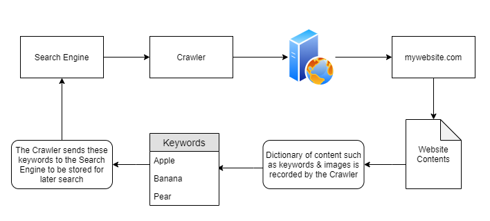

- Trong sơ đồ trên, "mywebsite.com" đã bị loại bỏ vì có các từ khóa như “Apple” “Banana" và “Pear”. Những từ khóa này được trình thu thập thông tin lưu trữ trong từ điển, sau đó trình thu thập thông tin sẽ trả lại những từ khóa này cho công cụ tìm kiếm, tức là Google . Nhờ sự kiên trì này, giờ đây Google đã biết tên miền “mywebsite.com” có các từ khóa `“Apple”`, `“Banana”` và `“Pear”`. Vì chỉ có một trang web được thu thập thông tin nên nếu người dùng tìm kiếm `“Apple”...“mywebsite.com”` sẽ xuất hiện. Điều này sẽ dẫn đến hành vi tương tự nếu người dùng tìm kiếm “Banana”. Vì nội dung được lập chỉ mục từ trình thu thập thông tin báo cáo tên miền có `"Banana"`, nó sẽ được hiển thị cho người dùng.

    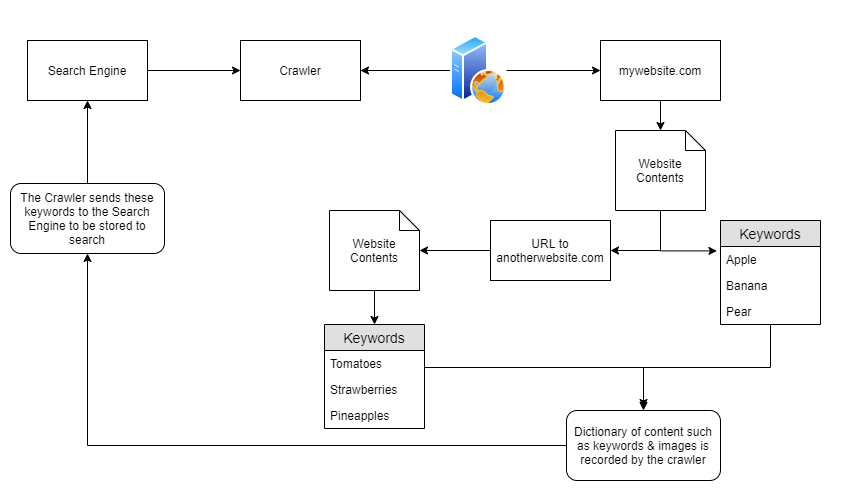

    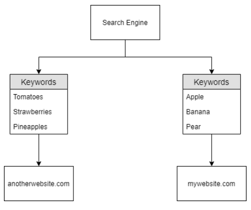

## **TASK 3**

> **Search Engine Optimisation**

- Search Engine Optimization (SEO) là một chủ để phổ biến trong giới search engine hiện nay. Nó phổ biến và thậm chí đem lại rất nhiều lợi nhuận, tới nỗi mà các doanh nghiệp lớn đầu tư rất nhiều để cải thiện SEO "ranking" - thứ hạng xuất hiện của trang web trên search engine
- Để trả lời câu hỏi cho phần trước, các search engine sẽ ưu tiên cho các website mà dễ index hơn. Và có rất nhiều yếu tố để đánh giá độ tối ưu của một trang web, ví dụ như:
  - Mức độ phản hồi của trang web với các trình duyệt khác nhau
  - Mức độ khó dễ khi crawl một website thông qua việc sử dụng sitemap
  - Website có những từ khóa gì
- Việc đánh giá các website giữa các search engine khác nhau nhìn chung sẽ khác nhau. Nhưng cuối cùng thì, các doanh nghiệp hoàn toàn có thể trả tiền để quảng cáo website, hoặc để boost "rank" của website
- Có thể kiểm tra xem trang web đã tôi ưu hóa công cụ tìm kiềm : [**Google's Site Analyser**](https://pagespeed.web.dev/)

    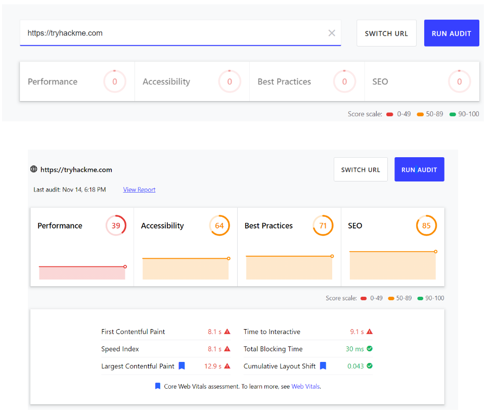

## **TASK 4**

> **Beepboop - Robots.txt**

- Tương tự như "Sơ đồ trang web" , "Robots.txt" thứ đầu tiên được "Trình thu thập thông tin" lập chỉ mục khi truy cập một trang web.

    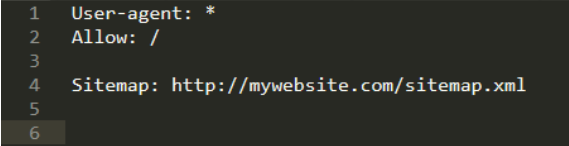

| Keyword     | Function |
| ----------- | ----------- |
| `User-agent`      | "Trình thu thập thông tin" có thể lập chỉ mục trang web của bạn ("*", cho phép tất cả "Người dùng")  |
| `Allow`   | Chỉ định các thư mục hoặc (các) tệp mà "Trình thu thập thông tin" có thể lập chỉ mục      |
| `Disallow` |Chỉ định các thư mục hoặc (các) tệp mà "Trình thu thập thông tin" không thể lập chỉ mục|
| `Sitemap` |Cung cấp tham chiếu đến vị trí của sơ đồ trang web (cải thiện SEO như đã thảo luận trước đó, chúng ta sẽ đến với sơ đồ trang web trong nhiệm vụ tiếp theo)|

    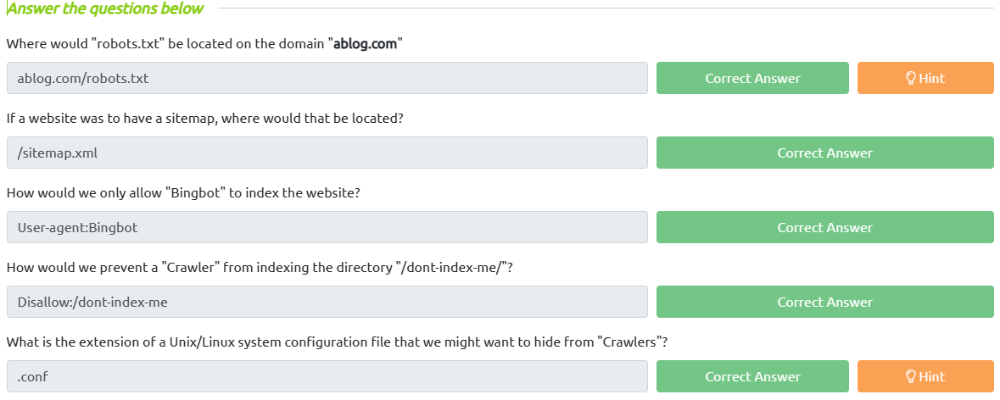

## **TASK 5**

> **Sitemaps**

- Sitemaps đóng vai trò như sự chỉ dẫn giúp cho crawler, bởi chúng chỉ ra những con đường để thu thập thông tin trong website. Cái biểu đồ bên dưới là ví dụ minh họa cho sitemap của một website:

    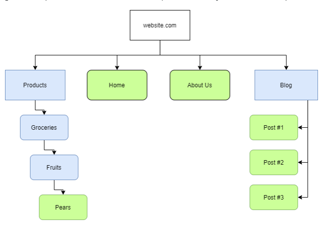

- Nhưng trên thực tế:

    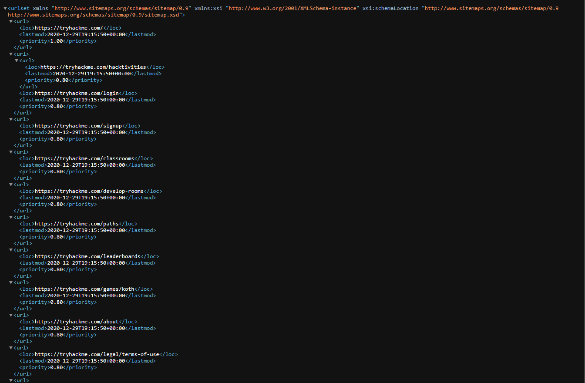

> **Tại sao "Sơ đồ trang web" lại thuận lợi cho Công cụ Tìm kiếm?**

- Các tài nguyên như "Sơ đồ trang web" cực kỳ hữu ích cho "Trình thu thập thông tin" vì các tuyến đường cần thiết đến nội dung đã được cung cấp! Tất cả những gì trình thu thập thông tin phải làm là loại bỏ nội dung này - thay vì trải qua quá trình tìm kiếm và loại bỏ thủ công. Hãy nghĩ về nó giống như sử dụng danh sách từ để tìm tệp thay vì đoán ngẫu nhiên tên của chúng!

    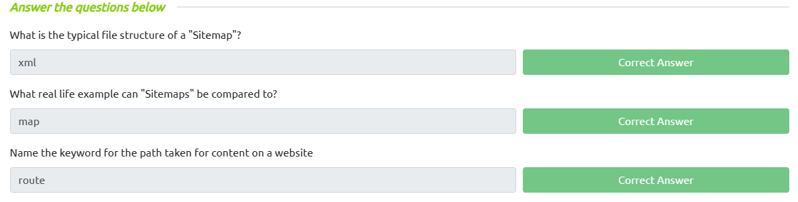

## **TASK 6**

> **Using Google for Advanced Searching**

- Nếu muốn thu hẹp truy vấn tìm kiếm của mình, chúng tôi có thể sử dụng dấu ngoặc kép.
- Sử dụng `site` để tìm kiếm liên quan đến nội dung một web site. Nó cũng sẽ tìm kiếm tên miền phụ cho chún ta.

    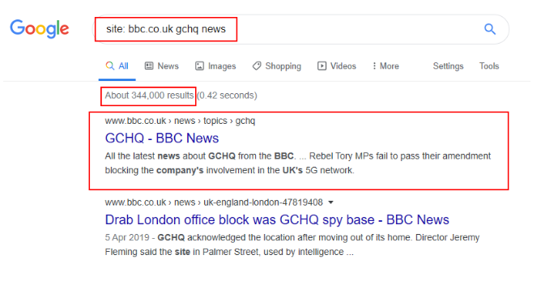

    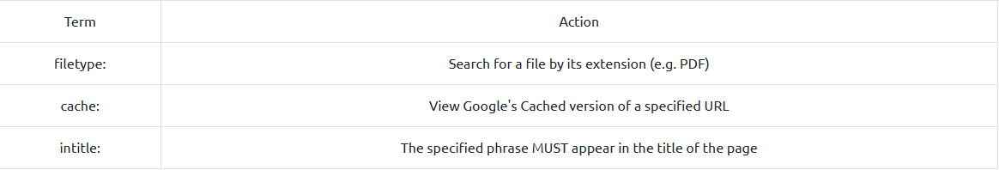

    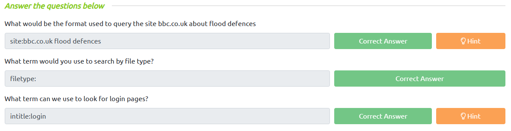

