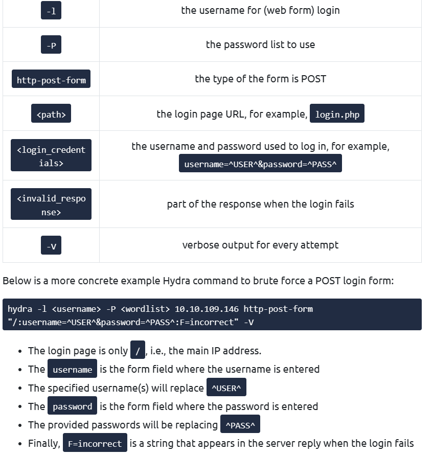
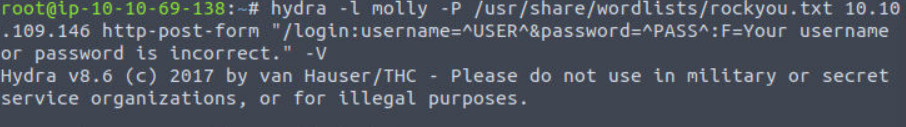
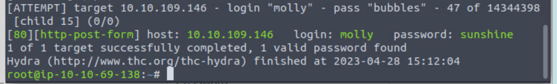
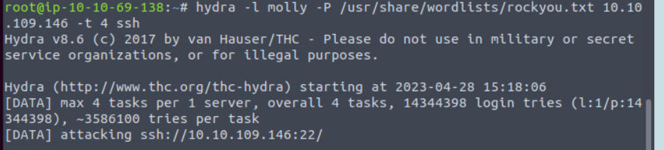
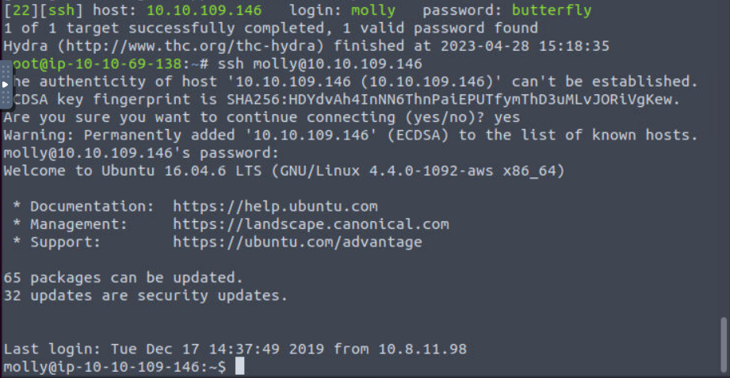
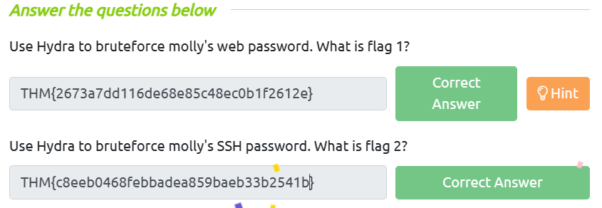

# **HYDRA**

## **HYDRA là gì?**

- Hydra là một chương trình bẻ khóa mật khẩu trực tuyến mạnh mẽ, một công cụ “hack” mật khẩu đăng nhập hệ thống nhanh chóng.

- Theo kho lưu trữ chính thức, Hydra hỗ trợ có khả năng brute force các giao thức sau: “Asterisk, AFP, Cisco AAA, Cisco auth, Cisco enable, CVS, Firebird, FTP, HTTP-FORM-GET, HTTP-FORM -POST, HTTP-GET, HTTP-HEAD, HTTP-POST, HTTP-PROXY, HTTPS-FORM-GET, HTTPS-FORM-POST, HTTPS-GET, HTTPS-HEAD, HTTPS-POST, HTTP-Proxy, ICQ, IMAP , IRC, LDAP, MEMCACHED, MONGODB, MS-SQL, MYSQL, NCP, NNTP, Oracle Listener, Oracle SID, Oracle, PC-Anywhere, PCNFS, POP3, POSTGRES, Radmin, RDP, Rexec, Rlogin, Rsh, RTSP, SAP /R3, SIP, SMB, SMTP, SMTP Enum, SNMP v1+v2+v3, SOCKS5, SSH (v1 và v2), SSHKEY, Subversion, TeamSpeak (TS2), Telnet, VMware-Auth, VNC và XMPP.”

- [**HYDRA tool**](https://en.kali.tools/?p=220)

## **Sử dụng HYDRA**

- Hydra commands:

  - Nếu chúng tôi muốn bắt buộc FTP với tên người dùng là `user` và danh sách mật khẩu là passlist.txt, chúng tôi sẽ sử dụng lệnh sau: `hydra -l user -P passlist.txt <ftp://10.10.109.146>
  - `Đối với SSH` : Ta có thể brute force như sau `hydra -l user -P passlist.txt ftp://10.10.109.146`
  - Chúng ta có thể brute force các form đăng nhập:
  `sudo hydra <username> <wordlist> 10.10.109.146 http-post-form "<path>:<login_credentials>:<invalid_response>"`

- Sau đây là phương pháp tôi brute force dựa trên rockyou.txt để tìm form post của 1 trang web.

- Tiếp theo, tôi brute force tìm mật khẩu molly trên SSH:

