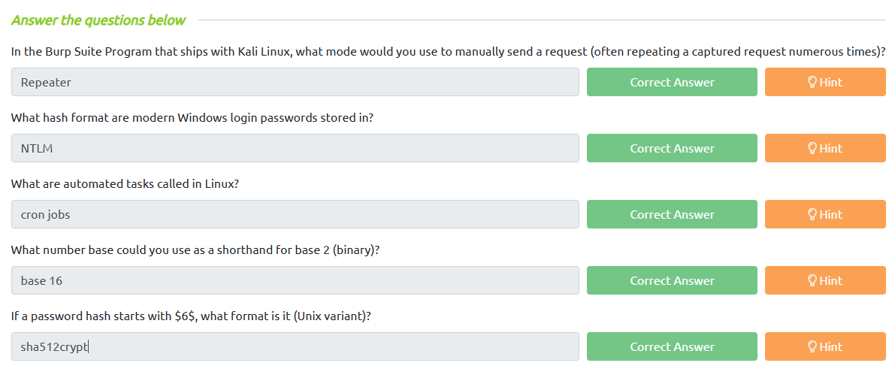

# **Introductory Researching**

- Khả năng research là phẩm chất quan trọng nhất của hacker.Về bản chất, việc hack đòi hỏi một nền tảng kiến thức rộng lớn — bởi vì làm sao bạn có thể đột nhập vào một thứ gì đó nếu bạn không biết nó hoạt động như thế nào?

- Tất cả mọi người (chuyên nghiệp hay nghiệp dư, có kinh nghiệm hay hoàn toàn mới với chủ đề này) sẽ gặp phải những vấn đề mà họ không tự động biết cách giải quyết. Đây là nơi nghiên cứu xuất hiện, vì trong thế giới thực, bạn không bao giờ có thể mong đợi được đưa ra câu trả lời cho câu hỏi của mình một cách đơn giản.

## **Example Research Question**

- Ví dụ bạn đã tải xuống một hình ảnh JPEG từ một máy chủ từ xa. Bạn nghi ngờ rằng có một cái gì đó ẩn giấu bên trong nó, nhưng làm thế nào bạn có thể lấy nó ra? Chúng ta hãy bắt đầu bằng cách tìm kiếm `“hiding things inside images”` trên Google:

- Từ đó, chúng ta biết kỹ thuật `Steganography` là một bộ công cụ tìm kiểm những thứ ẩn trong file ảnh.

- [**Hashcat**](https://github.com/frizb/Hashcat-Cheatsheet)

## **Vulnerability Searching**

- Thông thường, khi hack, bạn sẽ bắt gặp phần mềm có thể bị khai thác. Ví dụ: Hệ thống quản lý nội dung (chẳng hạn như Wordpress, FuelCMS, Ghost, v.v.) thường được sử dụng để giúp thiết lập trang web dễ dàng hơn và nhiều hệ thống trong số này dễ bị tấn công. Vậy chúng ta sẽ tìm ở đâu nếu muốn khai thác phần mềm cụ thể?

- Một số trang web liệt kê những lỗ hổng đã khai thác được:
  - [ExploitDB](https://www.exploit-db.com/)
  - [NVD](https://nvd.nist.gov/vuln/search)
  - [CVE Mitre](https://cve.mitre.org/)

- CVE (Common Vulnerabilities and Exposures)
  - Định dạng: `CVE-YEAR-IDNUMBER`

- `ExploitDB` có xu hướng rất hữu ích cho hacker, vì nó thường thực sự chứa các khai thác có thể được tải xuống và sử dụng ngay lập tức. Nó có xu hướng là một trong những điểm dừng đầu tiên khi bạn gặp phần mềm trong CTF hoặc pentest.

- Ở trên kali có một công cụ mang tên `searchsploit` cho chúng ta biết các lỗ hổng CVE ngay trên terminal mà không cần phải vào web `ExploitDB`.

## **Manual Pages**

- Ví dụ bạn muốn kết nối với một máy chủ từ xa nhưng bạn không biết lệnh thực thi của nó. Chúng ta có thể sử dụng lệnh `man SSH` để xem về lệnh của nó.

