# **Linux Fundamentals**

## **PART1**

>### **Introduction**

- Linux là một trong những hệ điều hành phổ biến nhất thế giới.

- Linux nhẹ hơn đáng kể so với các hệ điều hành khác. `Linux` thực sự là một thuật ngữ chung cho nhiều hệ điều hành dựa trên unix. Nhờ `UNIX` là mã nguồn mở, các biến thể của linux có đủ định dạng và kích cỡ phù hợp nhất với mục đích hệ thống.

- Ví dự : Ubuntu, Debian

- Làm quen với terminal:
  - `echo` : Xuất văn bản ra terminal
  - `whoami` : Tìm hiểu xem chúng tôi hiện đang đăng nhập với tư cách người dùng nào!
  - `ls` : liệt kê tất cả tên file có trong thư mục
  - `cd` : thay đổi thư mục
  - `cat` : đọc file
  - `pwd` : in ra tên file hiện tại thư mục
  - `find -name *.txt` : Tìm kiếm tất cả file.txt có trong thư mục con thư mục hiện tại

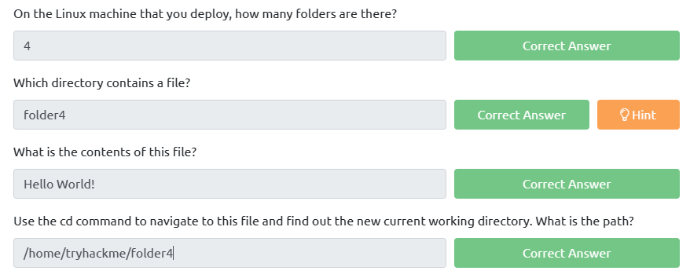

- Lệnh grep cho phép chúng tôi tìm kiếm nội dung của các tệp cho các giá trị cụ thể mà chúng tôi đang tìm kiếm.

- Lấy ví dụ, nhật ký truy cập của một máy chủ web. Trong trường hợp này, access.log của máy chủ web có 244 mục nhập.

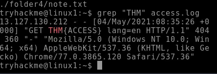

- Tìm hiểu về toán tử trong linux:
  - `&` : Toán tử này cho phép bạn chạy các lệnh ở chế độ nền của thiết bị đầu cuối
  - `&&` : Toán tử này cho phép bạn kết hợp nhiều lệnh với nhau trong một dòng của thiết bị đầu cuối.
  - `>` : Toán tử này là một bộ chuyển hướng - nghĩa là chúng ta có thể lấy kết quả đầu ra từ một lệnh (chẳng hạn như sử dụng cat để xuất tệp) và hướng nó đến nơi khác
  - `>>` : Toán tử này là một bộ chuyển hướng - nghĩa là chúng ta có thể lấy kết quả đầu ra từ một lệnh (chẳng hạn như sử dụng cat để xuất tệp) và hướng nó đến nơi khác

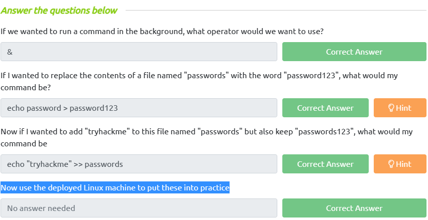

## **PART2**

> ### **Introduction**

- Tìm hiểu SSH:
  - Secure Shell hay SSH đơn giản là một giao thức giữa các thiết bị ở dạng mã hóa. Bằng cách sử dụng mật mã, bất kỳ thông tin đầu vào nào chúng tôi gửi ở định dạng con người có thể đọc được đều được mã hóa để di chuyển qua mạng -- tại đó thông tin này sau đó không được mã hóa khi đến máy từ xa, chẳng hạn như trong sơ đồ bên dưới.

    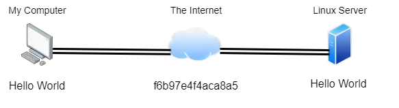

  - SSH cho phép chúng tôi thực thi từ xa các lệnh trên thiết bị khác từ xa.
  - Mọi dữ liệu được gửi giữa các thiết bị đều được mã hóa khi được gửi qua mạng chẳng hạn như Internet


- Tìm hiểu một số command mới:
  - `touch`: tạo file
  - `mkdir`: tạo folder
  - `cp` : copy file hoặc folder
  - `mv` : gán một file hoặc một folder
  - `rm` : Xóa một file hoặc một folder
  - `file` : Xác định loại file

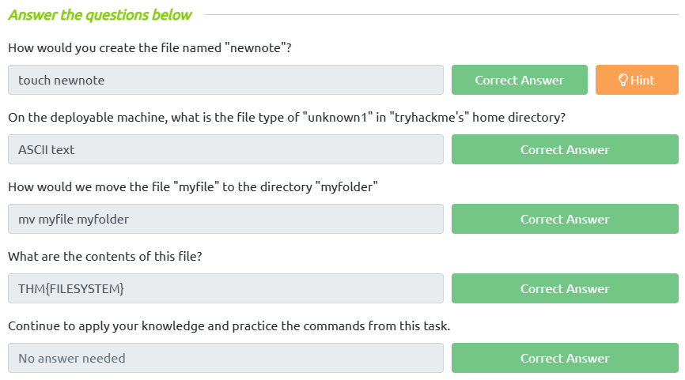

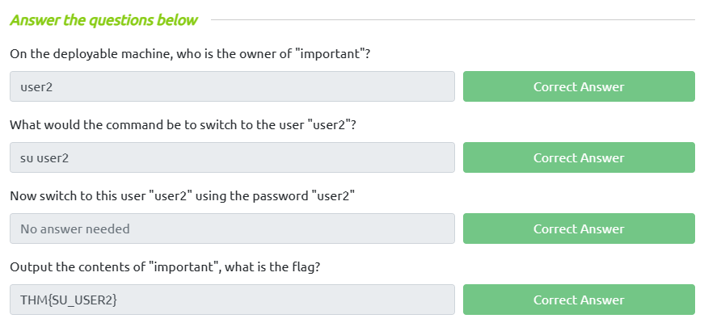

>### **Tìm hiểu về thư mục chung:**

- `/etc` : Thư mục gốc này là một trong những thư mục gốc quan trọng nhất trên hệ thống của bạn. Thư mục etc (viết tắt của etcetera) là một vị trí phổ biến để lưu trữ các tệp hệ thống được hệ điều hành của bạn sử dụng.

```
tryhackme@linux2:/etc$ ls
shadow passwd sudoers sudoers.d
```

- `/var` : Thư mục "/var" là một trong những thư mục gốc chính được tìm thấy trên bản cài đặt Linux. Thư mục này lưu trữ dữ liệu thường xuyên được truy cập hoặc ghi bởi các dịch vụ hoặc ứng dụng đang chạy trên hệ thống. Ví dụ: các tệp nhật ký từ các dịch vụ và ứng dụng đang chạy được ghi ở đây (/var/log)

```
tryhackme@linux2:/var$ ls
backups log opt tmp
```

- `/tmp` : Đây là một thư mục gốc duy nhất được tìm thấy trên bản cài đặt Linux. Viết tắt của "tạm thời", thư mục /tmp không ổn định và được sử dụng để lưu trữ dữ liệu chỉ cần truy cập một hoặc hai lần. Tương tự như bộ nhớ trên máy tính của bạn, khi máy tính được khởi động lại, nội dung của thư mục này sẽ bị xóa.

```
root@linux2:/tmp# ls
todelete trash.txt rubbish.bin
```

- `/bin`: Thư mục chứa các tệp lệnh cơ bản để khởi động hệ thống. Các tệp tin quan trọng bao gồm: bash, cat, cp, ls, mv, rm, v.v.
- `/boot`: Thư mục chứa các tệp tin cần thiết để khởi động hệ thống. Các tệp tin quan trọng bao gồm: vmlinuz (tệp tin hạt nhân Linux), initrd (tệp tin cần thiết cho quá trình khởi động hệ thống) và grub (tệp tin cấu hình GRUB).
- `/dev`: Thư mục chứa các tệp tin thiết bị, chẳng hạn như tệp tin thiết bị đĩa cứng (/dev/sda) hoặc tệp tin thiết bị đầu cuối (/dev/tty1).
- `/etc`: Thư mục chứa các tệp tin cấu hình hệ thống. Các tệp tin quan trọng bao gồm: passwd (tệp tin chứa thông tin người dùng), group (tệp tin chứa thông tin nhóm người dùng), và fstab (tệp tin cấu hình các thiết bị lưu trữ được gắn kết với hệ thống).
- `/home`: Thư mục chứa các thư mục cá nhân của người dùng. Mỗi người dùng trên hệ thống Linux sẽ có một thư mục cá nhân ở đây.
- `/lib`: Thư mục chứa các tệp thư viện cần thiết cho các chương trình trong /bin và /sbin.
- `/media`: Thư mục chứa các thiết bị lưu trữ có thể được gắn kết vào hệ thống, chẳng hạn như USB, đĩa CD hoặc đĩa cứng ngoài.
- `/mnt`: Thư mục được sử dụng để gắn kết các thiết bị lưu trữ vào hệ thống. Ví dụ, bạn có thể gắn kết một đĩa cứng ngoài vào /mnt/external.
- `/opt`: Thư mục chứa các ứng dụng bổ sung cài đặt trên hệ thống.
- `/proc`: Thư mục ảo chứa các tệp thể hiện trạng thái của hệ thống và

## **PART3**

>### **Introduction**

- Tạo chỉnh sửa file bằng nano:

```
nano file
```

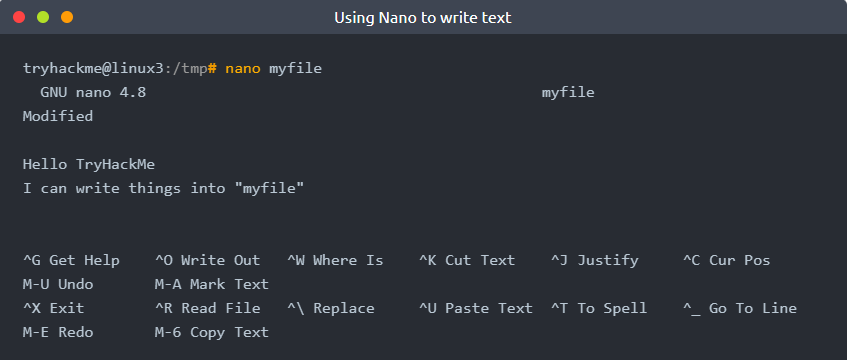

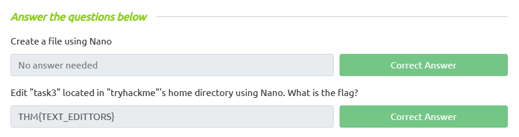

- Để tải xuống 1 tệp từ trang web tôi sử dụng lệnh `wget`:

```
wget https://assets.tryhackme.com/additional/linux-fundamentals/part3/myfile.txt
```

> ### **Transferring Files From Your Host - SCP (SSH)**

- Bản sao an toàn, hay SCP, chỉ có vậy -- một phương tiện sao chép tệp một cách an toàn. Không giống như lệnh cp thông thường, lệnh này cho phép bạn truyền tệp giữa hai máy tính bằng giao thức SSH để cung cấp cả xác thực và mã hóa.

```
scp important.txt ubuntu@192.168.1.30:/home/ubuntu/transferred.txt

Ngược lại:

scp important.txt ubuntu@192.168.1.30:/home/ubuntu/transferred.txt
```

> ### **Processes**

- Tiến trình là các chương trình đang chạy trên máy của bạn. Chúng được quản lý bởi nhân, trong đó mỗi tiến trình sẽ có một ID được liên kết với nó, còn được gọi là PID của nó. PID tăng dần theo thứ tự mà quá trình bắt đầu. I E. tiến trình thứ 60 sẽ có PID là 60.

- `ps` : cung cấp danh sách các tiến trình đang chạy dưới dạng phiên của người dùng và một số thông tin bổ sung như mã trạng thái của nó, phiên đang chạy nó, lượng thời gian sử dụng CPU mà nó đang sử dụng và tên của chương trình hoặc lệnh thực tế đang được thực thi.

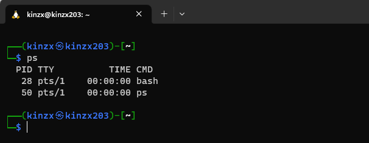

- Để xem các tiến trình được chạy bởi những người dùng khác và những tiến trình không chạy từ một phiên (tức là các tiến trình hệ thống), chúng ta cần cung cấp phụ trợ cho lệnh ps như sau:

- `ps aux`

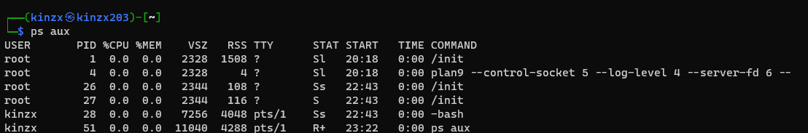

- `top`: Cung cấp thông tin tiến trình một cách chi tiết và chính xác.

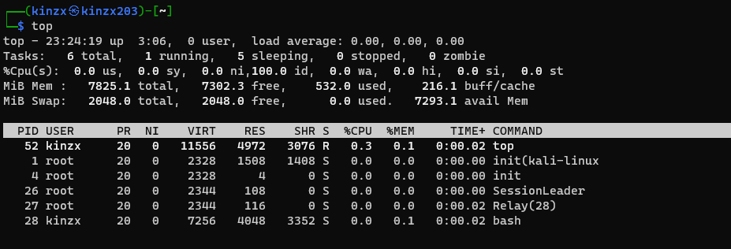

- Một khi hệ thống khởi động và khởi chạy, systemd là một trong những tiến trình đầu tiên được khởi động. Bất kỳ chương trình hoặc phần mềm nào mà chúng tôi muốn bắt đầu sẽ bắt đầu dưới dạng tiến trình con của systemd.

  - `systemctl start apache2`
  - `systemctl [option] [service]`
  - Option:
    - Start
    - Stop
    - Enable
    - Disable

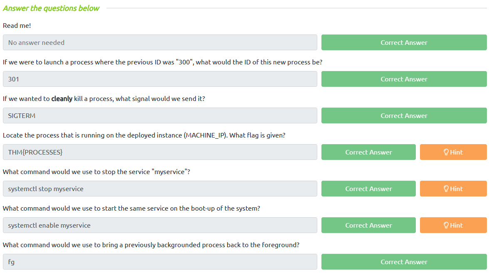

> ### **Tìm hiểu về crontabs**

- Người dùng có thể muốn lên lịch cho một hành động hoặc tác vụ nào đó diễn ra sau khi hệ thống đã khởi động. Lấy ví dụ: chạy các lệnh, sao lưu tệp hoặc khởi chạy các chương trình yêu thích của bạn, chẳng hạn như Spotify hoặc Google Chrome.
- Chúng ta sẽ nói về quy trình cron, nhưng cụ thể hơn là cách chúng ta có thể tương tác với nó thông qua việc sử dụng crontab.

- Một crontab chỉ đơn giản là một tệp đặc biệt có định dạng được quy trình cron nhận dạng để thực thi từng dòng một. Crontabs yêu cầu 6 giá trị cụ thể:
  - `MIN` : Thực hiện vào phút nào.
  - `HOUR`: Thực hiện vào tiếng nào.
  - `DOM` : Thực hiện vào ngày nào trong tháng.
  - `MON` : Thực hiện vào tháng mấy trong năm.
  - `DOW` : Ngày nào trong tuần để thực hiện tại.
  - `CMD` : Lệnh thực tế sẽ được thực thi.
- `0 *12 * * * cp -R /home/cmnatic/Documents /var/backups/`

- [**Crontab Generator**](https://crontab-generator.org/)
- [**Tool cron**](https://quickref.me/cron)

> ### **Tìm hiểu apt**

- Khi các nhà phát triển muốn gửi phần mềm tới cộng đồng, họ sẽ gửi phần mềm đó tới kho lưu trữ "apt". Nếu được chấp thuận, các chương trình và công cụ của họ sẽ được tung ra thị trường. Hai trong số các tính năng đáng giá nhất của Linux tỏa sáng ở đây: Khả năng truy cập của người dùng và giá trị của các công cụ nguồn mở.

- Trong khi các nhà cung cấp Hệ điều hành sẽ duy trì các kho lưu trữ của riêng họ, bạn cũng có thể thêm các kho lưu trữ cộng đồng vào danh sách của mình! Điều này cho phép bạn mở rộng khả năng của hệ điều hành. Các kho lưu trữ bổ sung có thể được thêm vào bằng cách sử dụng lệnh `add-apt-repository` hoặc bằng cách liệt kê một nhà cung cấp khác! Ví dụ: một số nhà cung cấp sẽ có kho lưu trữ gần vị trí địa lý của họ hơn.

- Chúng ta thường hay dùng lệnh `apt` để cài đặt phần mền trên ubuntu.

- Chúng ta có thể thêm các gói apt như sau:

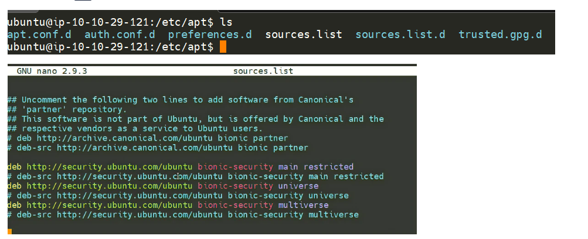

- Chúng ta có thể thêm các gói apt bằng cách thủ công như sau:

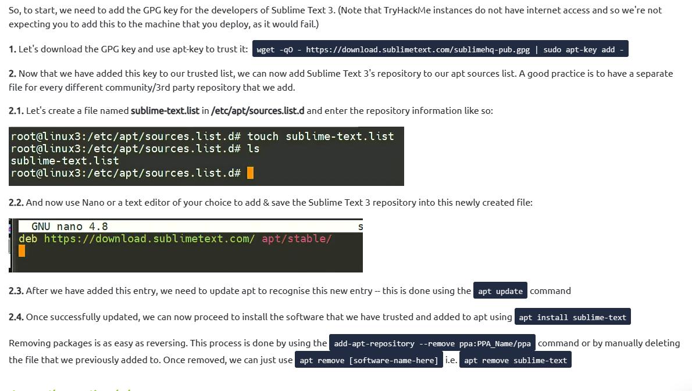

> ### **Tìm hiểu nhật kí hệ thống Logs**

- Tệp nhật ký nằm trong thư mục `/var/log/`.Các tệp và thư mục này chứa thông tin ghi nhật ký cho các ứng dụng và dịch vụ đang chạy trên hệ thống của bạn. Hệ điều hành (HĐH) đã trở nên khá giỏi trong việc tự động quản lý các nhật ký này trong một quy trình được gọi là "xoay vòng".

- Tôi đã đánh dấu một số nhật ký từ ba dịch vụ chạy trên máy Ubuntu:
  - Apache2
  - Dịch vụ UFW được sử dụng làm tường lửa
  - Nhật ký cho dịch vụ fail2ban

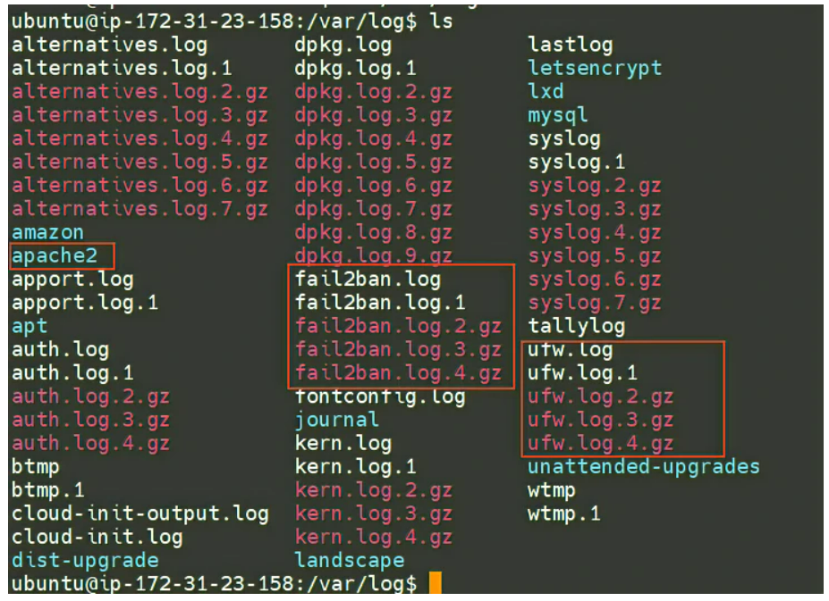

- Trong Apache có 2 loại logs cần quan tâm:
  - access log
  - error log

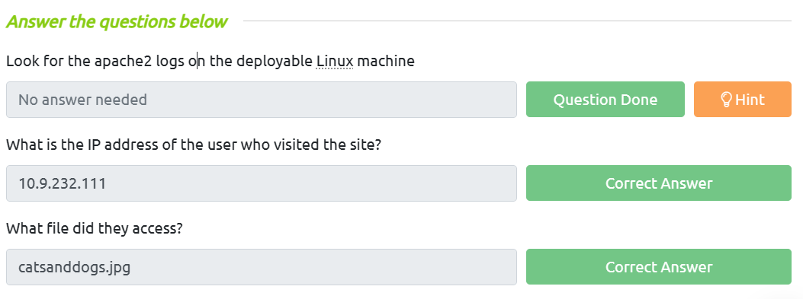
