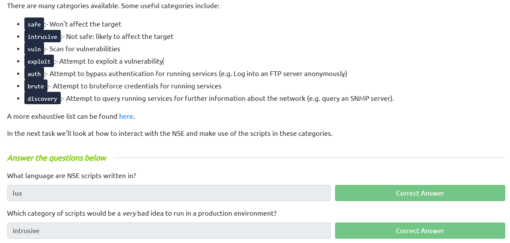

# **Nmap**

## **TASK 2 - Introduction**

- Giả sử khi chúng ta thực hiện kiểm tra bảo mật và có 1 địa chỉ ip. Chúng ta cần thiếp lập kiểm tra có những cổng dịch vụ nào đang hoạt động trên địa chỉ ip đó,

- Các kết nối mạng được thực hiện giữa hai cổng – một cổng mở đang lắng nghe trên máy chủ và một cổng được chọn ngẫu nhiên trên máy tính của bạn. Ví dụ: khi bạn kết nối với một trang web, máy tính của bạn có thể mở cổng 49534 để kết nối với cổng 443 của máy chủ.


- Và nmap là một công cụ quét xem có những cổng dịch vụ nào đang mở của địa chỉ ip.


## **TASK 3 - Nmap Switches**

- Chúng ta hãy đi tìm hiểu về nmap. Trước hết, chúng ta thực hiện câu lệnh `man nmap` để biết thông tin, cú pháp cũng như ví dụ và các option về nmap.


- Dưới đây là một số option khi sử dụng với nmap:
  - `Syn Scan: -sS`
  - `USP Scan: -sU`
  - `Để biết được hệ điều hành địa chỉ ip : -O`
  - `Để có nhiều thông tin hơn ở đầu ra sau khi quét: -v hoặc -vv`
  - `Để lưu kết quả nmap ở dạng "normal": -oN`
  - `Để lưu kết quả nmap ở dạng "grepable": -oG`
  - `Để sử dụng tất cả option: -A`
  - `Để scan ports : -p 80 , scan tất cả ports: -p-`

## **TASK 4 - Overview**

- Để quét cổng chúng ta có 3 cách sau:
  - TCP Connect Scans (-sT)
  - SYN "Half-open" Scans (-sS)
  - UDP Scans (-sU)
  - TCP Null Scans (-sN)
  - TCP FIN Scans (-sF)
  - TCP Xmas Scans (-sX)

## **TASK 5 - TCP Connect Scans**

- Để hiểu về phương thưc quét TCP Scan chúng ta phải phải hiểu về `three-way handshake`.


- `Three-way handshake` bao gồm 3 giai đoạn:
  - Đầu tiên, bên phía clien sẽ gửi một yêu cầu kết nối TCP với cờ SYN.
  - Sau đó bên phía server sẽ phản hồi phía clien với cờ SYN và ACK
  - Cuối cùng, client nhận tín hiệu và gửi lại ACK cho server và thiếp lập kết nối TCP.'
- Để xác định cổng đã được đóng hay chưa:
  - Client sẽ gửi SYN tới server
  - Server sẽ phản hồi RST. Từ đấy, ta sẽ biết cổng này đã được đóng.

- Có một số trường hợp cổng vẫn đang mở nhưng bị ẩn sau tường lửa.

```
iptables -I INPUT -p tcp --dport <port> -j REJECT --reject-with tcp-reset
```


## **TASK 6 - SYN Scans**


- Quá trình quét SYN thường không được ghi lại bời các ứng dụng đang lắng nghe cổng mở, vì theo thường lệ quá  trình sẽ được ghi lại khi kết nối được thiết lập đầy đủ.

- Không cần phải bận tâm về việc hoàn thành (và ngắt kết nối khỏi) quá trình bắt tay ba bước cho mọi cổng, quá trình quét SYN nhanh hơn đáng kể so với quá trình quét Kết nối TCP tiêu chuẩn.

- Nhược điểm với quét SYN:
  - Chúng yêu cầu quyền sudo để hoạt động chính xác trong linux.
  - Các dịch vụ không ổn định đôi khi bị hỏng do quét SYN.


## **TASK 7 - UDP Scans**

- Không giống như TCP, UDP thực hiện gửi các gói tin mà không cần thực hiện xác thực kết nối. Chính vì điều đó sẽ khiến UDP có tốc độ hơn, chất lượng hơn như chia sẻ video. Bên cạnh đó, việc thiếu xác thực UDP khiền việc scan sẽ khó hơn.

- Khi một gói được gửi đến một cổng UDP đã đóng, server sẽ phản hồi bằng gói ICMP (ping) chứa thông báo rằng cổng không thể truy cập được.

- Vì quét cổng UDP lâu hơn so với TCP nên để cải thiện chúng ta sẽ quét 20 cổng phổ biến như sau:

```
nmap -sU --top-ports 20 <target>
```

## **TASK 8 - NULL, FIN and Xmas**

- Scan NULL (-sN) là khi yêu cầu TCP được gửi mà không có cờ nào được đặt. Theo RFC, máy chủ đích sẽ phản hồi bằng RST nếu cổng bị đóng.


- Thay vì gửi một gói hoàn toàn trống, một yêu cầu được gửi với cờ FIN (thường được sử dụng để đóng một kết nối đang hoạt động


## **TASK 9 - ICMP Network Scanning**


- Nmap có chức năng gọi là `ping sweep`. Nmap gửi một gói ICMP tới từng địa chỉ IP có thể có trong dải mạng. Khi nhận được phản hồi, nó sẽ đánh dấu địa chỉ IP đã phản hồi là hoạt động.

- Để thực hiện quét dải địa chỉ IP ta thực hiện như sau:

```
nmap -sn 192.168.0.1-254
```

## **TASK 10 - NSE Scripts Overview**

- Nmap Scripting Engine (NSE) là những tập lệnh được viết từ ngôn ngữ Lua và có thể thực hiện được nhiều việc khác nhau như: Quét lỗ hổng cũng như khai thác lỗ hổng.

- Một vài option điển hình:
  - `safe:`- Won't affect the target
  - `intrusive:`- Not safe: likely to affect the target
  - `vuln:`- Scan for vulnerabilities
  - `exploit:`- Attempt to exploit a vulnerability
  - `auth:`- Attempt to bypass authentication for running services (e.g. Log into an FTP server anonymously)
  - `brute:`- Attempt to bruteforce credentials for running services
  - `discovery:`- Attempt to query running services for further information about the network (e.g. query an SNMP server).



## **TASK 11 - Working with the NSE**

- Để chạy tập lệnh script chúng ta thực hiện như sau: `--script=<script-name> , e.g. --script=http-fileupload-exploiter`.

- Có thể thực hiện nhiều script một lúc bằng cách ngăn cách bằng dấu phẩy: `--script=smb-enum-users,smb-enum-shares`

- Chúng ta có thể tìm kiếm nhưng tham số yêu cầu với script như sau: `nmap --script-help <script-name>`


## **TASK 12 - NSE Scripts Searching for Scripts**

- Để tìm kiếm script chúng ta có 2 cách :
  - [Nmap website](https://nmap.org/nsedoc/)
  - Nmap lưu trữ các tập lệnh của nó trên Linux tại `/usr/share/nmap/scripts`


## **TASK 13 - Firewall Evasion**

- Máy chủ Windows điển hình với tường lửa mặc định, sẽ chặn tất cả các gói ICMP.

- Nmap cung cấp một tùy chọn cho việc này: `-Pn`, tùy chọn này yêu cầu Nmap không bận tâm ping máy chủ trước khi quét nó. Điều này có nghĩa là Nmap sẽ luôn coi (các) máy chủ đích là còn sống, bỏ qua khối ICMP một cách hiệu quả; tuy nhiên, nó phải trả giá bằng khả năng mất nhiều thời gian để hoàn thành quá trình quét (nếu máy chủ thực sự đã chết thì Nmap sẽ vẫn kiểm tra và kiểm tra lại mọi cổng được chỉ định).

- Một số option đáng chú ý:
  - `-f:` Được sử dụng để phân mảnh các gói (tức là chia chúng thành các phần nhỏ hơn) làm cho các gói ít có khả năng bị phát hiện bởi tường lửa hoặc IDS.
  - `--mtu <số>`, chấp nhận kích thước đơn vị truyền tối đa để sử dụng cho các gói được gửi. Đây phải là bội số của 8.
  - `--scan-delay <time>ms:`- được sử dụng để thêm độ trễ giữa các gói được gửi. Điều này rất hữu ích nếu mạng không ổn định, nhưng cũng để tránh bất kỳ trình kích hoạt tường lửa/IDS dựa trên thời gian nào có thể có.
  - `--badsum:` Được sử dụng để kiểm tra tổng gói tin.

- [BYPASS FIREWALL](https://nmap.org/book/man-bypass-firewalls-ids.html)

## **TASK 14 - Practical**

```
1. sudo nmap -PE 10.10.184.180
2. sudo nmap -p 1-999 -sX 10.10.184.180 -Pn -vv
3. sudo nmap -p1 5000 -sS 10.10.184.180 -Pn -vv
4. sudo nmap --script=ftp-anon -p 21 10.10.184.180 -vv
```
