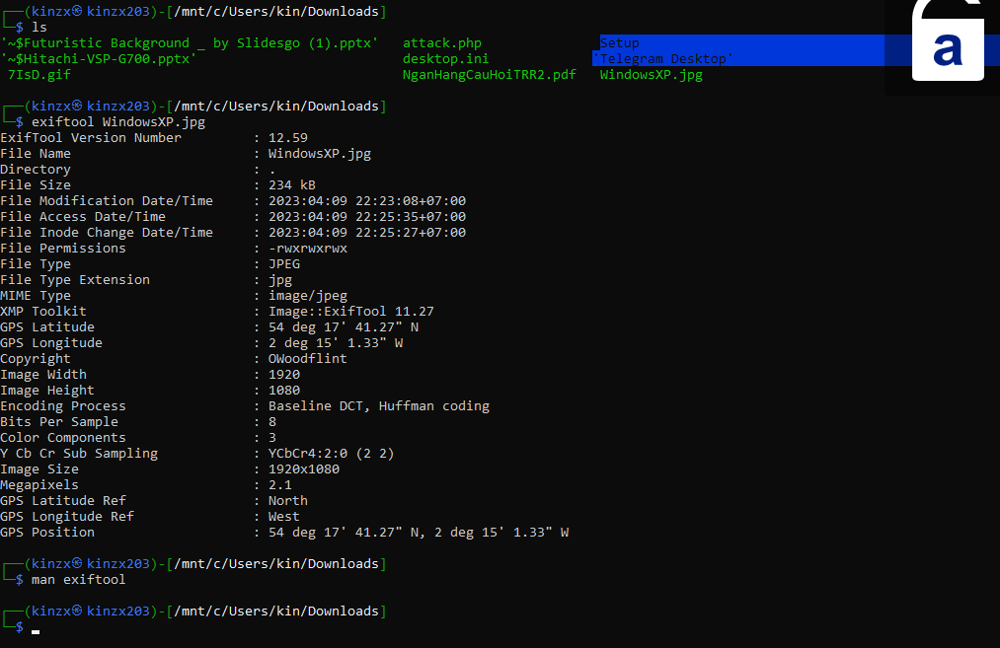
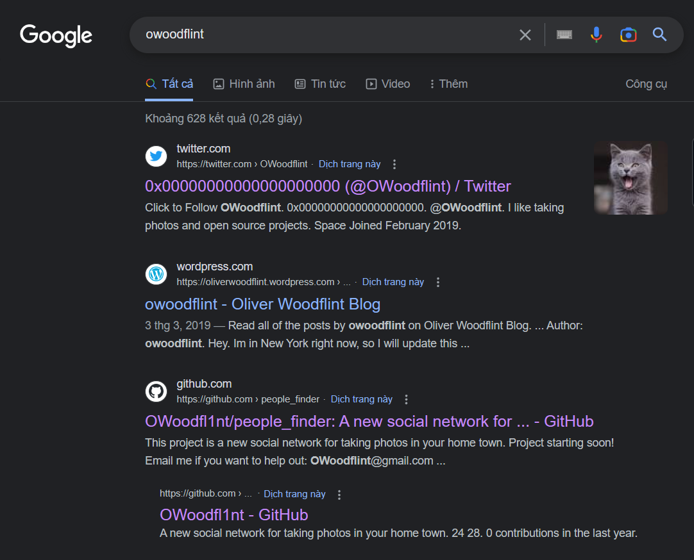
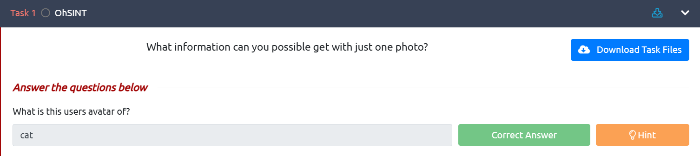
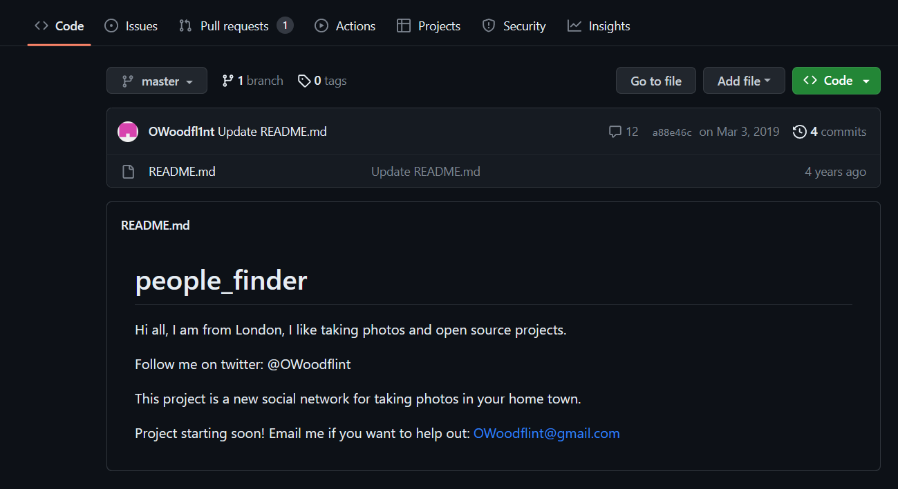
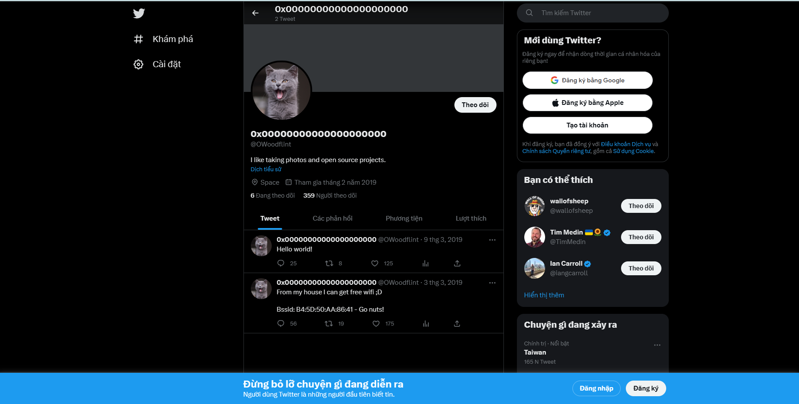
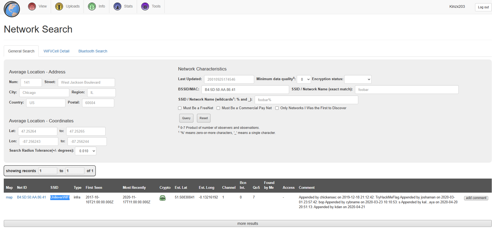
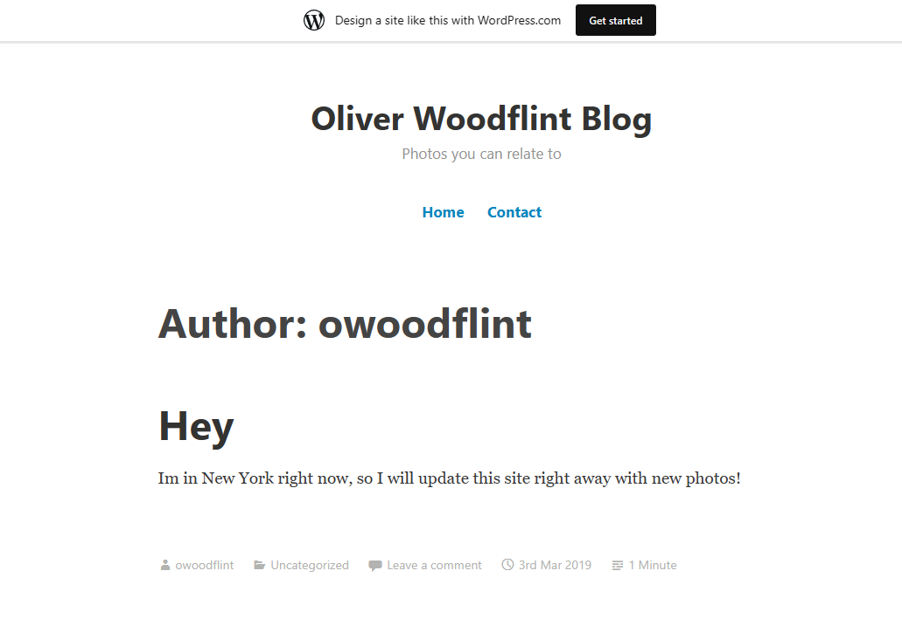
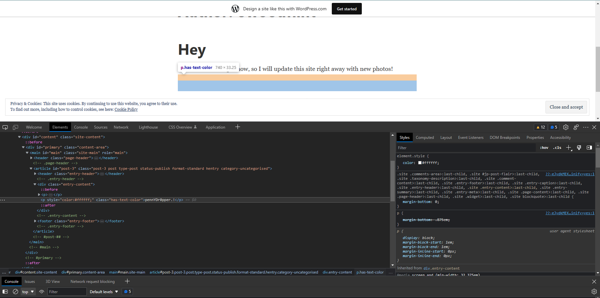

# **OhSINT**

## **What is this users avatar of?**

- Sau khi chúng ta download hình ảnh về. Tôi đã đưa vào exiftool để biết thêm thông tin hình ảnh.

    

- Chúng ta thấy được `Copyright: Owoodflint`. Từ đấy, Tôi đã tra gg và nhận được thông tin tài khoản `Owoodflint`

    

- Tôi đã thấy được avatar con mèo.

    

- Tiếp theo tôi đã tra được thành phố đang ở của người có tài khoản `Owoodflint`

    

## **Whats the SSID of the WAP he connected to?**

- Ở tài khoản twitter ta đã biết được BSSID. Từ đó, ta có thể tìm kiếm ra SSID thông qua trang web sau : <https://wigle.net/search?netid=B4%3A5D%3A50%3AAA%3A86%3A41>

    

- Từ trang web ta tìm kiếm được `SSID = UnileverWiFi`

    

## **What is his personal email address?**

- Từ trang github trước đấy tôi đã tìm ra được địa chỉ email.

## **Where has he gone on holiday?**

- Qua việc search gg trước đó tôi đã tìm thấy 1 wordpress mang tên tài khoản `owoodflint`. Từ đấy, Tôi biết được kì nghỉ anh ấy ở đâu. Đó chính là `Newyork`.

    

## **What is this persons password?**

    

