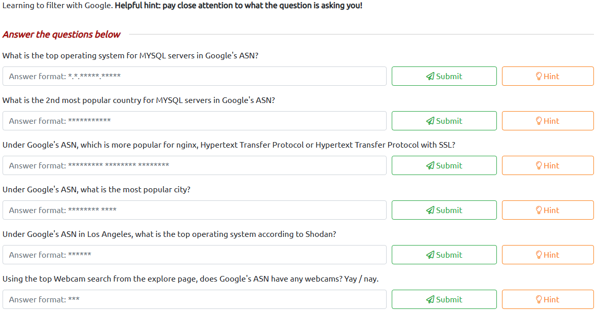
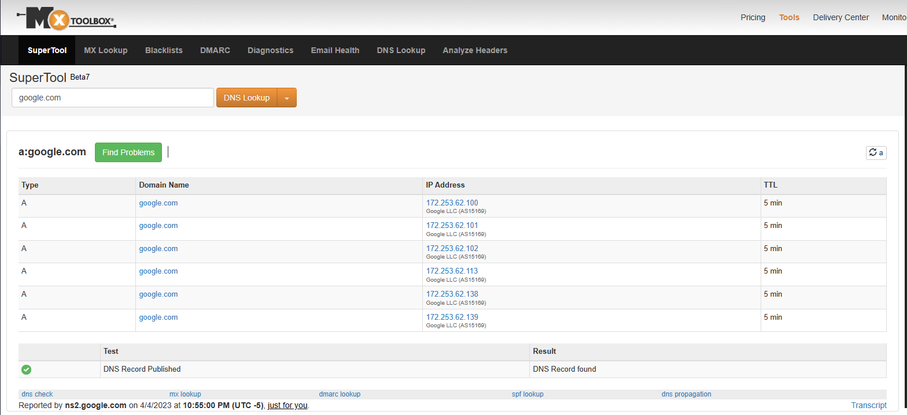
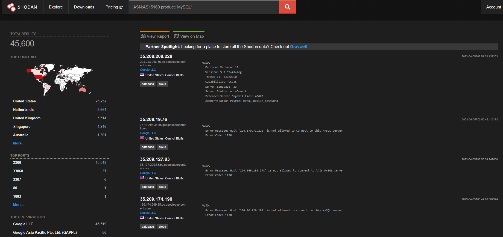
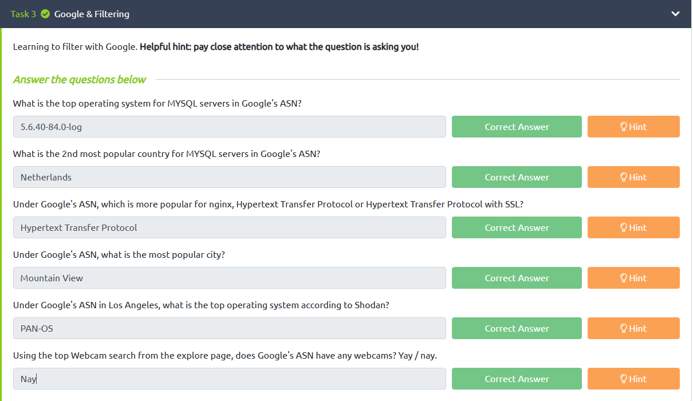
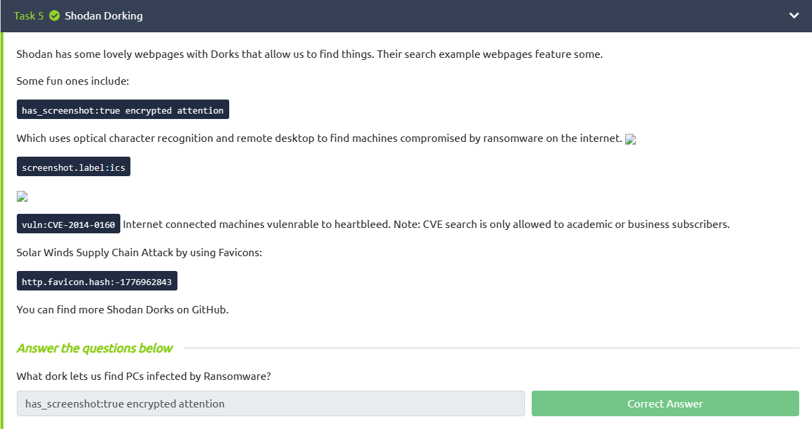
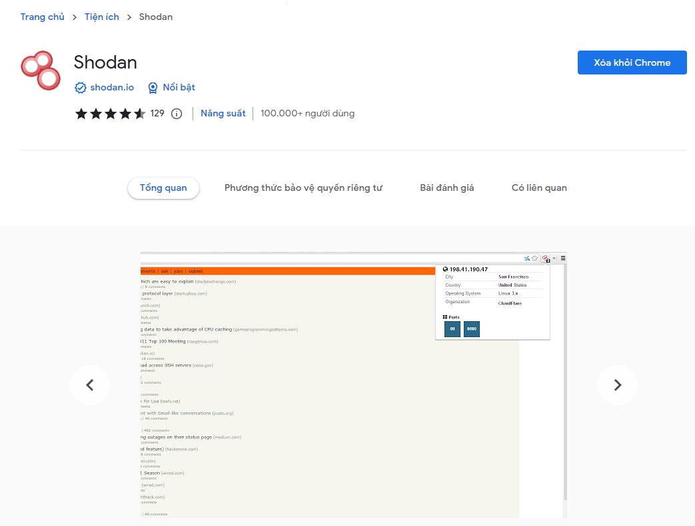

# **Shodan.io**

## **Task 1 ( Introduction )**

- Shodan.io là một công cụ tìm kiếm cho Internet of Things.

- Shodan có thể quét toàn bộ internet và lập chỉ mục các dịch vụ chạy trên từng địa chỉ IP.

>### **Autonomous System Numbers**

- Shodan thực hiện tìm kiếm các service qua `Autonomous System Numbers`
- ASN là số nhận dạng toàn cầu của một dải địa chỉ IP.

- Chúng ta có thể đặt địa chỉ IP vào công cụ tra cứu ASN, chẳng hạn như <https://www.shodan.io/>,

- Điều này cho chúng tôi biết họ có ASN AS14061.

## **Task 2 ( Filters )**

- Trên trang chủ Shodan.io, chúng ta có thể nhấp vào “Explore” để xem các truy vấn tìm kiếm được bình chọn nhiều nhất. Phổ biến nhất là webcam.
- <https://www.shodan.io/explore>

- Một trong những tìm kiếm thịnh hành:
  - Tìm kiếm cơ sở dữ liệu: `product:MySQL`
    - Ví dụ: asn: `AS14061 product:MySQL`
  - Bộ lọc yêu thích của tôi là bộ lọc vuln, cho phép chúng tôi tìm kiếm các địa chỉ IP dễ bị khai thác.
  - Giả sử chúng ta muốn tìm các địa chỉ IP dễ bị tấn công bởi Eternal Blue: `vuln:ms17-010`

## **Task 3 ( Google & Filtering )**

    

- Trước khi đi đến trả lời câu hỏi đầu tiên, ta sẽ cần tìm ASN google thông qua NS lookups.

    

- Từ đây, ta có được ASN google là `AS15169`.Từ đấy ta tìm được version MySQL GG.

    

    

## **Task 4 ( Shodan Monitor )**

- Shodan Monitor là một ứng dụng để giám sát các thiết bị của bạn trong mạng của riêng bạn.Nó sẽ thiết lập thông báo, khởi chạy quét và có được khả năng hiển thị đầy đủ về những gì bạn đã kết nối.

- Shodan Monitor thực hiện quét toàn bộ thiết bị mạng của chúng ta nếu có một trong những lỗ hổng sau đây thì nó sẽ gửi mail về cho chúng ta:
  - Top Open Ports (most common)
  - Top Vulnerabilities (stuff we need to deal with right away)
  - Notable Ports (unusual ports that are open)
  - Potential Vulenrabilites
  - Notable IPs (things we should investigate in more depth).

## **Task 5 ( Shodan Dorking )**

- Shodan có một số trang web ưa thích với Dork cho phép chúng tôi tìm thấy mọi thứ. Các trang web mẫu tìm kiếm của họ có một số tính năng.

- Nó có thể thực hiện một số tân công. Ví dụ trang web cho ta thấy các hình ảnh mà camera đang hoạt động bằng câu lệnh `screenshot.label:ics`

    

## **Task 6 ( Shodan Extension )**

- Khi được cài đặt, bạn có thể nhấp vào nó và nó sẽ cho bạn biết địa chỉ IP của máy chủ web đang chạy, cổng nào đang mở, nó đặt ở đâu và liệu nó có bất kỳ vấn đề bảo mật nào không.

    

## **Task 7 ( Exploring the API & Conclusion )**

- API cho phép chúng tôi tìm kiếm Shodan theo chương trình và nhận lại danh sách các địa chỉ IP. Nếu chúng tôi là một công ty, chúng tôi có thể viết một tập lệnh để kiểm tra các địa chỉ IP của mình để xem liệu có địa chỉ nào dễ bị tấn công hay không.

- [**How-I-Hacked-Your-Pi-Hole**
](https://github.com/bee-san/How-I-Hacked-Your-Pi-Hole/blob/master/README.md)
