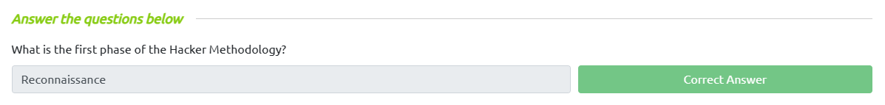
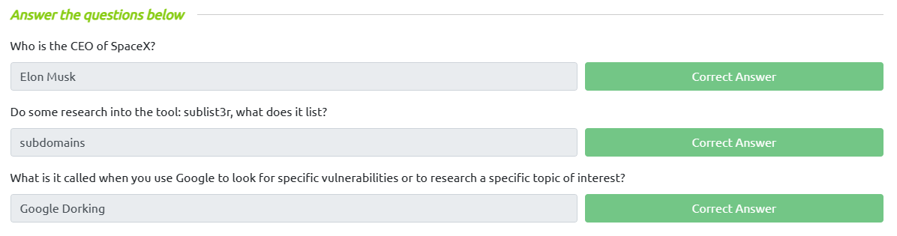
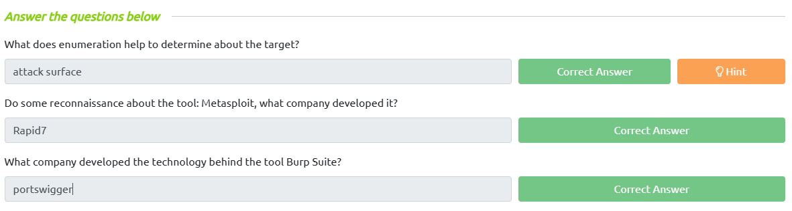
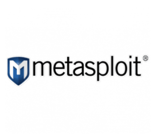
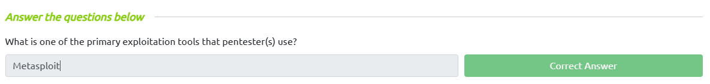
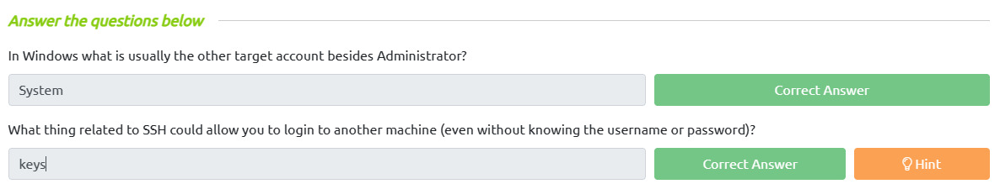
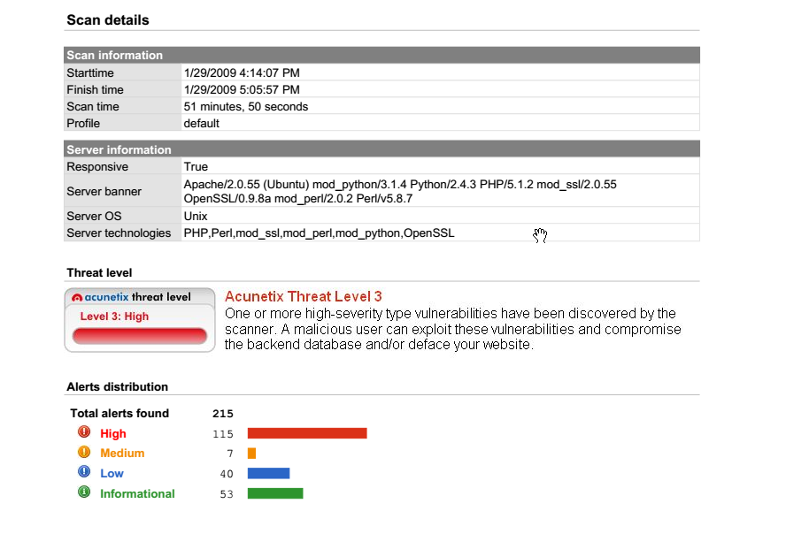
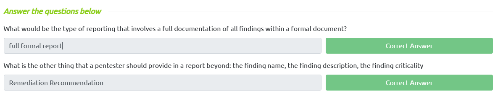

# **The Hacker Methodology**

## **I. Methodology Outline**

> **Quy trình mà một hacker tuân theo?**

- Một hacker chuyên nghiệp thường tuân theo một quy trình thiết lập để khai thác các mục tiêu của họ.

- Quá trình mà pentesters tuân theo:
  - Reconnaissance
  - Enumeration/Scanning
  - Gaining Access
  - Privilege Escalation
  - Covering Tracks
  - Reporting

## **II. Reconnaissance Overview**

- Reconnaissance là thu nhập tất cả thông tin về mục tiêu.

- Một trong những công cụ hữu ích nhát mà Hacker thường sử dụng là Google.

- Mặc dù có vẻ đơn giản, `Reconnaissance` là giai đoạn quan trọng nhất của thử nghiệm thâm nhập.

- Có một số công cụ chuyên dụng mà chúng ta có thể sử dụng:
  - Google (specifically Google Dorking)
  - Wikipedia
  - PeopleFinder.com
  - who.is
  - sublist3r
  - hunter.io
  - builtwith.com
  - wappalyzer

## **III. Enumeration and Scanning Overview**

- Đây là giai đoạn mà hacker tương tác vơi mục tiêu để cố gắng tìm các lỗ hổng liên quan đến mục tiêu.

- Các công cụ như nmap, dirb, metasploit, mining-db, Burp Suite và các công cụ khác rất hữu ích để giúp chúng tôi cố gắng tìm lỗ hổng trong mục tiêu. (Đừng lo lắng về chúng bây giờ, bạn có thể bắt tay vào thực hiện sau)

## **III. Exploitation**

- Một công cụ phổ biến được sử dụng để khai thác được gọi là Metasploit có nhiều tập lệnh tích hợp sẵn.

## **IV. Privilege Escalation**

- Sau khi chúng ta có quyền truy cập vào máy nạn nhân thông qua giai đoạn khai thác, bước tiếp theo là nâng cấp đặc quyền tài khoản lên quyền cao hơn.
  - Windows : Administrator or System
  - Linux : Root
- Leo thang đặc quyền có thể có nhiều, nhiều hình thức, một số ví dụ :
  - Cracking mật khẩu được tìm thấy trên mục tiêu
  - Tìm một dịch vụ hoặc phiên bản dễ bị tấn công sẽ cho phép bạn leo thang đặc quyền qua dịch vụ
  - Tìm khóa bí mật hoặc khóa SSH được lưu trữ trên thiết bị sẽ cho phép xoay vòng sang máy khác

  - `find / -perm -4000 -type f 2>/dev/null` : xem liệu người dùng có quyền truy cập vào bất kỳ lệnh nào mà họ có thể chạy với quyền root không

## **V. Covering Tracks**

- Bạn phải luôn có sự cho phép rõ ràng từ chủ sở hữu hệ thống về thời điểm diễn ra thử nghiệm, cách thức diễn ra và phạm vi mục tiêu trong bất kỳ thử nghiệm thâm nhập nào.

- Khi tăng được mức đặc quyền thì chúng ta phải báo cáo khách hàng ngay lập tức.

## **VI. Reporting**

- Giai đoạn cuối cùng của pentest là giai đoạn viết báo cáo.
- Giai đoạn báo cáo thường bao gồm những điều sau:
  - The Finding(s) or Vulnerabilities
  - The CRITICALITY of the Finding
  - A description or brief overview of how the finding was discovered
  - Remediation recommendations to resolve the finding

